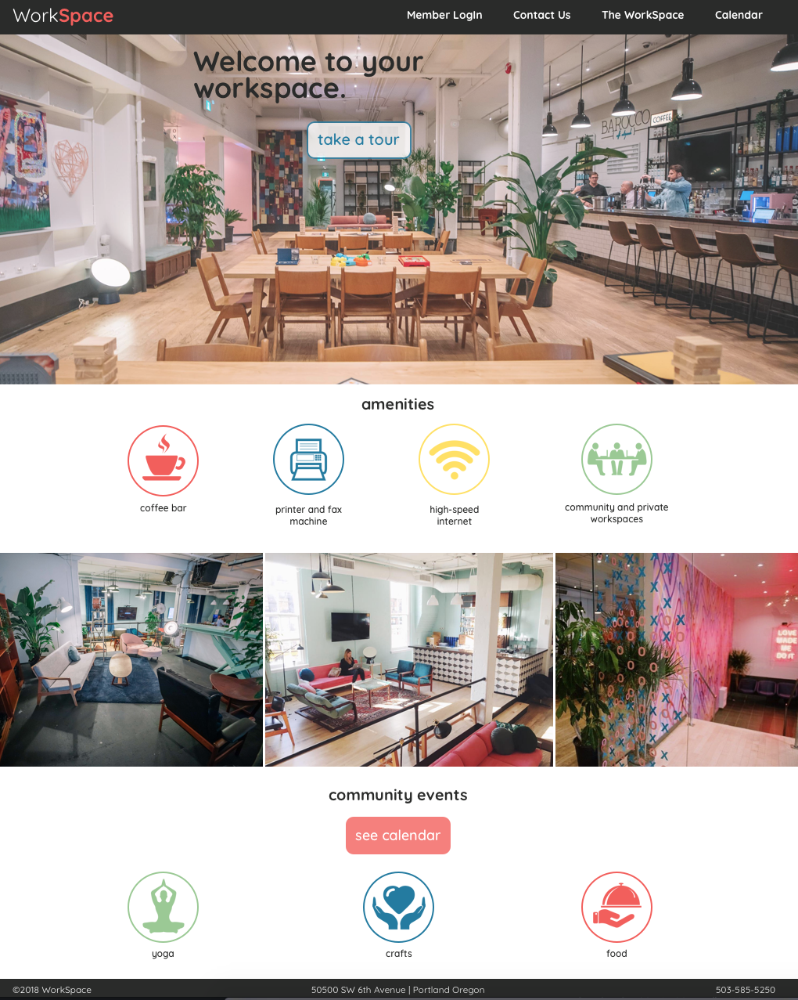
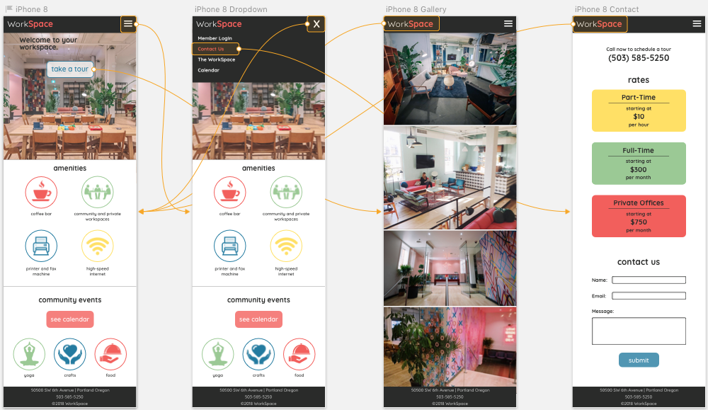

## Freelance for Workspace
##### Robin Sola // June 1, 2018
---
###### Live Site:
https://work-space-a280c.firebaseapp.com/
#### Desktop Version

#### Mobile Version

### Description

As a freelance developer, This project involves shaping the design and structure of a responsive website, including a mobile version, for a brand new community workspace.

## Installation
* Clone project folder in terminal: `$ git clone` repository url
* In terminal, run `$ npm install` in project folder home directory
* In terminal, run `$ ng serve --open` to view in browser

### Brainstorming

The workspace theme keywords:
* Luxurious / Cool / High-end / Welcoming / Approachable / Safe / Comfortable / Productive / FUNKY not Corporate / Artsy
* Coffee / Internet / Crafty / Inspiring
* Writers / Artists / Counselors / Tech-folk
* Both Independent and Collaborative

Color theme keywords:
* Yellows / Blues / Pinks / Greens
* Bright and cheerful / Green plants around the workspace
* Blue and Pink walls / Spray painted hearts mural along the entry wall

Specific Hex-Colors:
* #F25F5C - redish/pinkish/orangish
* #FFE066 - yellow
* #247BA0 - blue
* #9BC995 - mint green
* #50514F - lighter gray/brown for some stability and contrast
* #2A2B2A - darker gray/brown
* #617073 - lighter gray/blue

Font Research:
* Sophisticated-Funk, Clean, Simple, Warm, Soft, Welcoming
* Sans-serif / light for paragraph content / bold for headers
* Cabin
* Jua
* Quicksand
* Josefin Sans / 400 / 700

Site Content:
* Logo / Company Name
* Company Tagline / Welcoming Statement
* Images (gallery) of Workspace
* Amenities (with icons): Coffee Counter, Communal or private spaces, High Speed Internet, Printing and Faxing, Thursday Activities (yoga, food, crafts)
* Links: Member Login, Contact Us, Take a Tour, Events Calendar, Location Info, Become a Member

### Technologies and Resources
* Sketch
* npm/Webpack
* HTML
* CSS / SASS
* Angular

### License
##### Copyright (c) 2018 Robin Sola.
Permission is hereby granted, free of charge, to any person obtaining a copy of this software and associated documentation files (the "Software"), to deal in the Software without restriction, including without limitation the rights to use, copy, modify, merge, publish, distribute, sublicense, and/or sell copies of the Software, and to permit persons to whom the Software is furnished to do so, subject to the following conditions:

The above copyright notice and this permission notice shall be included in all copies or substantial portions of the Software.

THE SOFTWARE IS PROVIDED "AS IS", WITHOUT WARRANTY OF ANY KIND, EXPRESS OR IMPLIED, INCLUDING BUT NOT LIMITED TO THE WARRANTIES OF MERCHANTABILITY, FITNESS FOR A PARTICULAR PURPOSE AND NONINFRINGEMENT. IN NO EVENT SHALL THE AUTHORS OR COPYRIGHT HOLDERS BE LIABLE FOR ANY CLAIM, DAMAGES OR OTHER LIABILITY, WHETHER IN AN ACTION OF CONTRACT, TORT OR OTHERWISE, ARISING FROM, OUT OF OR IN CONNECTION WITH THE SOFTWARE OR THE USE OR OTHER DEALINGS IN THE SOFTWARE.
